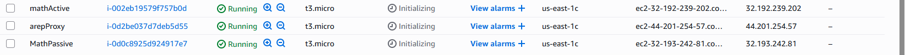
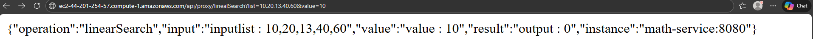
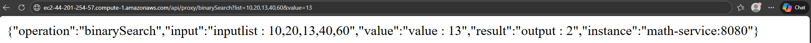
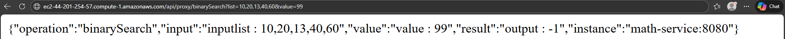

# SEGUNDO PARCIAL AREP 2026-1
## Autor: Sebastian Galvis Briceño

Para desarrollar el examen, es necesario llevar a cabo la creación del proyecto math-arep-sgb, repositorio de maven con SpringBoot el cual contendrá el backend del mismo.

## Estructura del proyecto

Utilizaremos la siguiente estructura para el repositorio:
```
math-arep-sgb
│
├── README.md
├── .gitignore
├── pom.xml
│
├── math-arep-sgb/
│   ├── pom.xml
│   └── src/
│       ├── main/
│       │   ├── java/
│       │   │   └── com/arep
│       │   │       ├── MathServiceApplication.java
│       │   │       ├── controller/MathController.java
│       │   │       ├── model/MathResponse.java
│       │   │       └── service/MathOperationsService.java
│       │   └── resources/
│       │       └── application.properties
│       └── test/
│           └── java/
│               └── com/arep
│                   └── MathServiceApplicationTests.java
│
└── proxy-service/
├── pom.xml
└── src/
├── main/
│   ├── java/
│   │   └── com/proxy
│   │       ├── ProxyServiceApplication.java
│   │       ├── controller/ProxyController.java
│   │       ├── model/MathResponse.java
│   │       └── service/ProxyForwardService.java
│   └── resources/
│       ├── application.properties
│       └── static/
│           ├── index.html
│           ├── style.css
│           └── app.js
└── test/
    └── java/
        └── com/proxy
            └── ProxyServiceApplicationTests.java
```

Esto quiere decir que, en este repositorio, encontraremos los proyectos del math-service (math-arep-sgb) y el proxy-service


## Despliegue

Una vez terminada y probada localmente la aplicación, creamos las tres instancias de AWS que sostendrán nuestro proyecto:


ec2-44-201-254-57.compute-1.amazonaws.com - PROXY
ec2-32-193-242-81.compute-1.amazonaws.com - MathPassive
ec2-32-192-239-202.compute-1.amazonaws.com - MathActive

En cada instancia corremos el proyecto correspondiente (math-arep-sgb en MathPassive y MathActive y proxy-service en PROXY)

## Prueba

Finalmente, verificamos que la aplicación esté funcionando en la instacia AWS:

**Búsqueda lineal:**


**Búsqueda binaria:**


**Búsqueda binaria no exitosa:**


